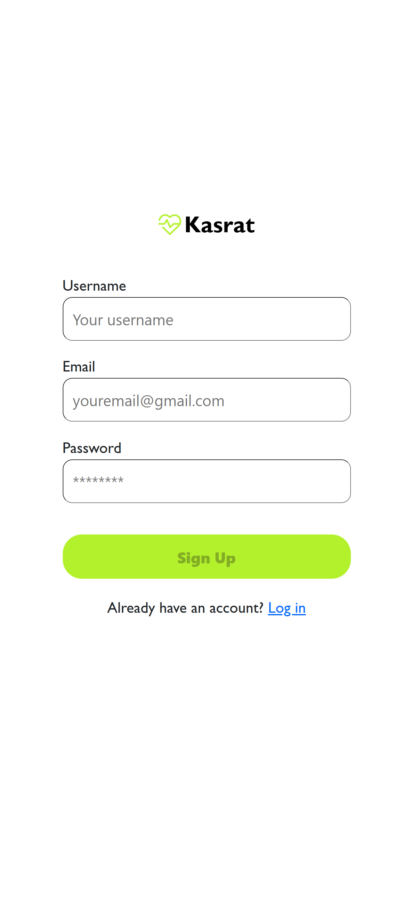
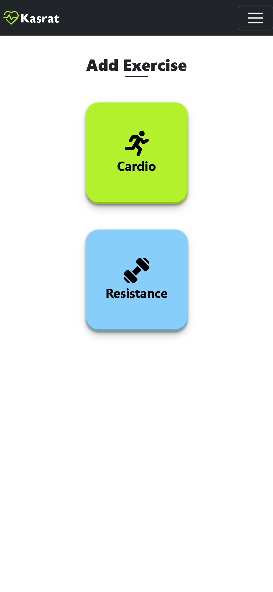
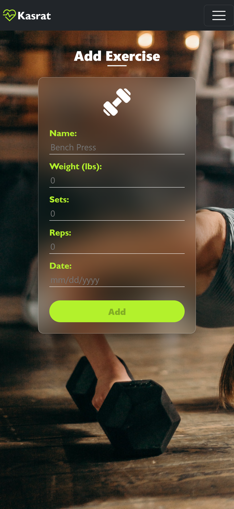
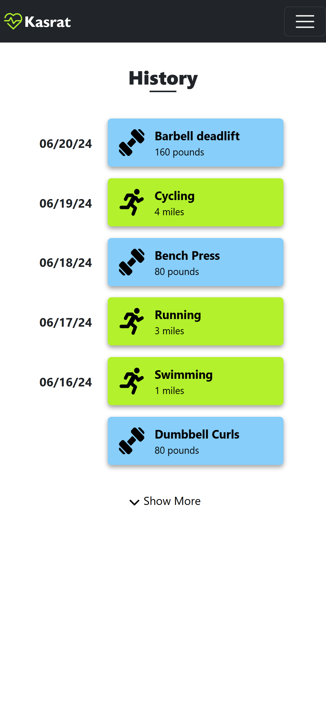
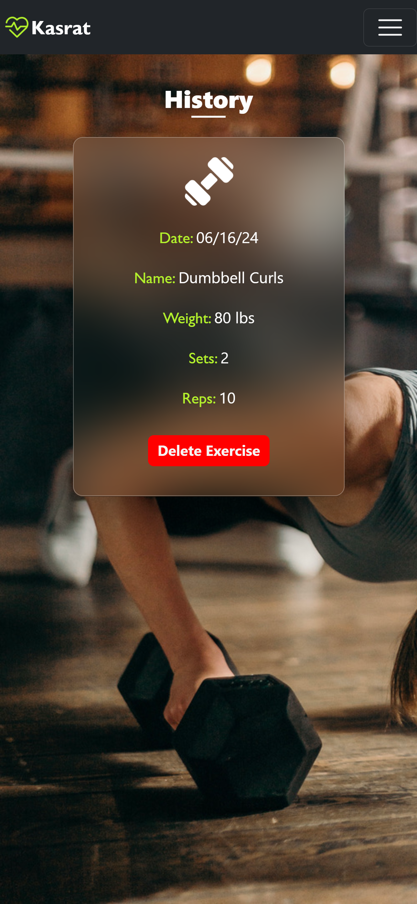

# Kasrat
A MERN-stack workout tracker app.

## Table of Contents

- [Description](#description)
- [Technology](#Technology)
- [Installation](#installation)
- [Usage](#usage)
- [License](#license)
- [Contribution](#contribution)
- [Questions](#questions)

## Description:

This MERN-stack project is a personal creation aimed at simplifying fitness tracking. It features a responsive design for seamless use across devices and employs JWT authentication for secure access. Users can log workouts, track cardio and resistance exercises, and review their exercise history with ease. Features include logging and tracking of both cardio and resistance exercises, viewing of workout history, and ability to delete exercises records.

## Technology:

Project is created with:

- Mongoose
- Express.js
- React.js
- Node.js
- JWT Authentication

## Installation

To run this project, install it locally using npm:

```
npm install
```

## Usage

After installing npm packages, the application will be invoked by using the following command:

```
npm run develop
```


#### Example Screenshot

- Home Page <br>
  

- Login Page <br>
  

- Exercise Page <br>
  

- Add Cardio <br>
  

- Add Resistance <br>
  

- History Page <br>
  

- Single Cardio History <br>
  

- Single Resistance History <br>
  

## License

[](https://opensource.org/licenses/MIT) <br>
This project is licensed under MIT, for more information please visit [this website](https://opensource.org/licenses/MIT)

## Contribution

- Icons are from www.flaticon.com
- Backgroun photos are from www.pexels.com
- Made by silver-faang

## Questions?

Please feel free to contact me if you need any further information:

- [Email](silverfangstudent9@gmail.com)
- [Github Profile](https://github.com/silver-faang)
